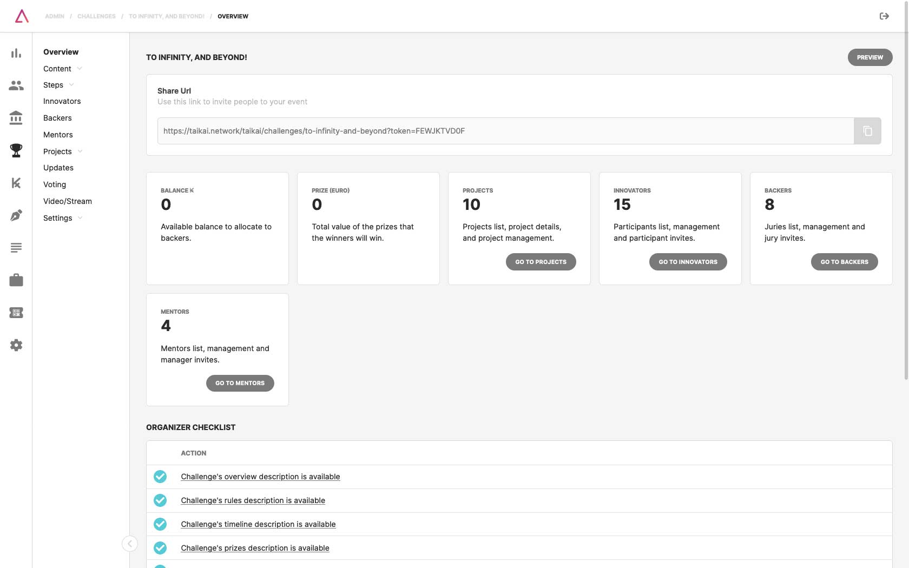

### 1. Overview
Some statistics, shortcuts, and a list of essential tasks to do when creating the challenge. If it is a private challenge, the URL that should be shared to invite users to the event is also visible.
### 2. Content
Editing of descriptive content of the challenge. In the resources tab, assets (files, images, etc.) can also be made available to participants.

- **Overview:** definition and long description. The goal on this section is to detail what the challenge is about and what is the macro-result you want to achieve.
- **Rules:** these rules are the Challenge Terms & Conditions. Some examples of conditions that should be present in these rules:
  - Who posts the challenge?;
  - Who may apply (18 or more, students, etc.)?;
  - Challenge timeline;
  - Deliverables;
  - Selection process;
  - Prizes;
  - Intellectual property;
  - Challenge cancellation conditions;
  - Other relevant conditions.

:::note
Here’s a good example you can get inspiration from: [taikai.network/gulbenkian/challenges/hack-for-good-home/rules](https://taikai.network/gulbenkian/challenges/hack-for-good-home/rules)
:::

- **Timeline:** in this tab you should define all the steps of the challenge (e.g. application, participation, voting, results).

:::note
Here’s a good example you can get inspiration from: [taikai.network/gulbenkian/challenges/hack-for-good-home/timeline](https://taikai.network/gulbenkian/challenges/hack-for-good-home/timeline)
:::

- **Prizes:** prizes to be assigned to the challenge winner(s).
- **FAQs:** set of questions and answers that may be useful and accessible to the participants.
- **Resources:** files that may be considered relevant to the participants such as guides and other tools.

### 3. Steps
Configuration of the various steps of the challenge (e.g., ideation, development, pitches, results), manual or automatic change of steps, and configuration of dates and registration forms.

- Step List
- Registration

### 4. Innovators
Participant management and send invites via email to participants.

### 5. Backers
Backers management and send invites via email to backers.

### 6. Mentors
Mentors management and send invites via email to mentors.

### 7. Projects
Project management and check the voting results before announcing them.

- Project List
- Leaderboard

### 8. Updates
Post messages on your challenges to be seen by all participants and voters.

### 9. Voting
See the current voting cards and their details. Criteria group creation if the criteria-based voting scheme is used.

### 10. Video/Stream
Stage management, live stream events, sharing the stream on different channels, and managing videos on demand.

### 11. Settings
Edit the challenge information, customize the project's default template, manage categories, custom buttons, custom tabs, and advanced challenge settings.

- General
- Project Template
- [Categories](challenge-categories.md)
- Custom Links
- Custom Tabs
- Advanced