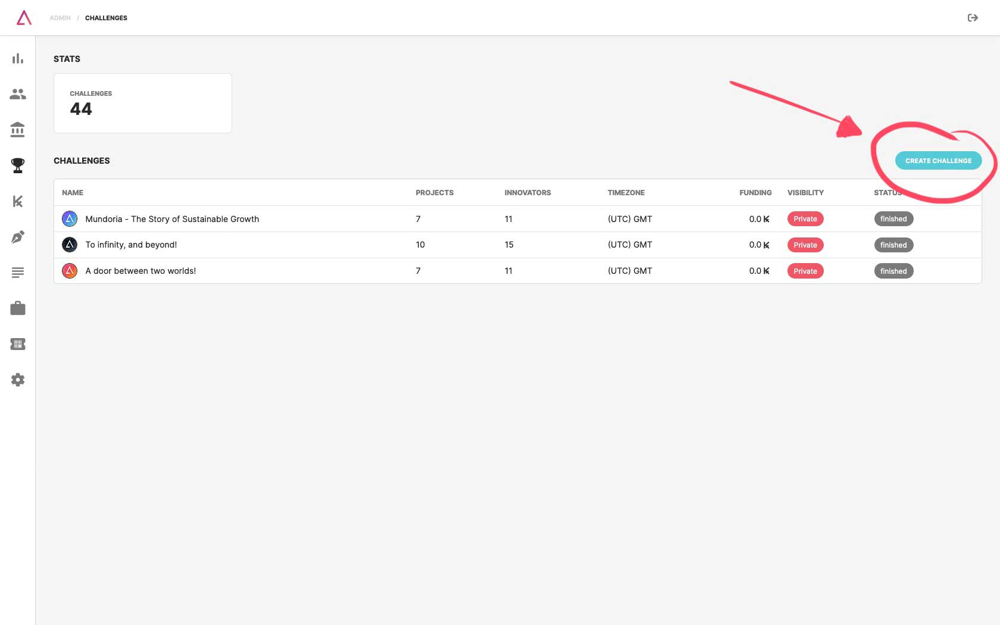
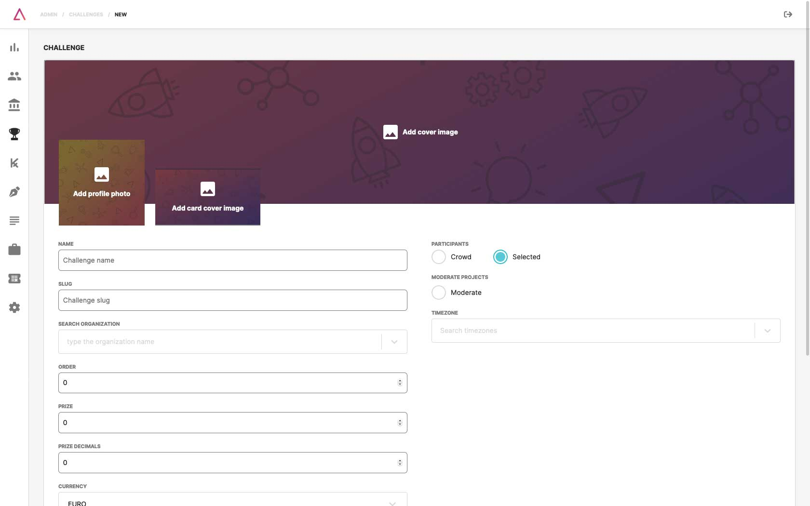

### 1. Challenges List

Click on the **challenges menu** and click on the button to **Create Challenge** on the right top corner.

### 2. Create Challenge

**Create your challenge** with information bellow and click on **save** when you're done:

- Images:
  - Logo (400x400);
  - Cover (1500x500);
  - Card (600x400);
- Challenge name;
- Challenge slug;
- Prizes, currency, related insdustries, type of participants, projects moderation and timezone;
- Short description.

:::note
**Organization slug** is the path that completes the organization's URL on the TAIKAI platform. (e.g., taikai.network/org-name)
:::