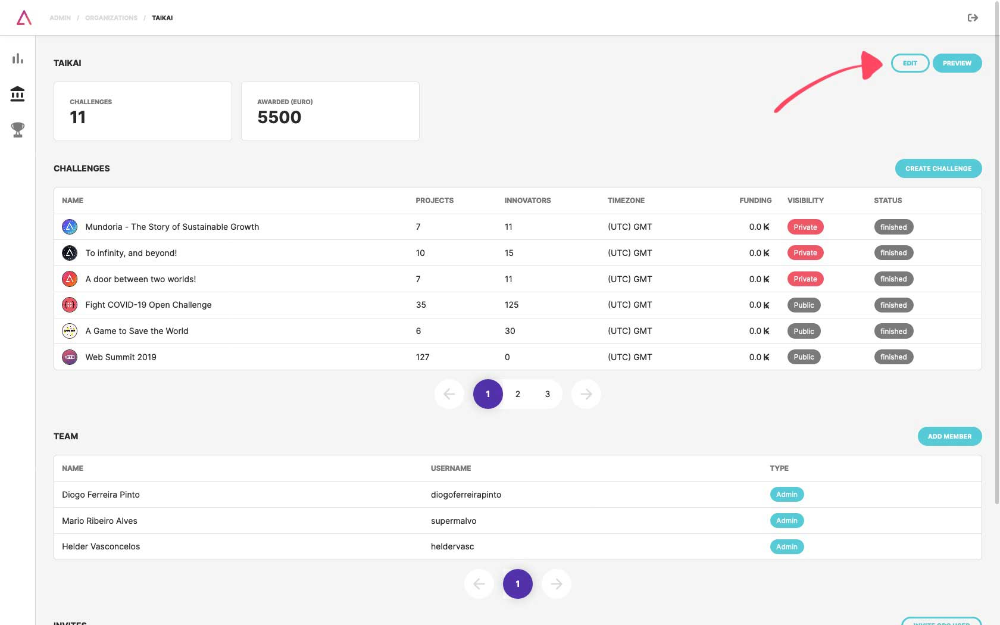
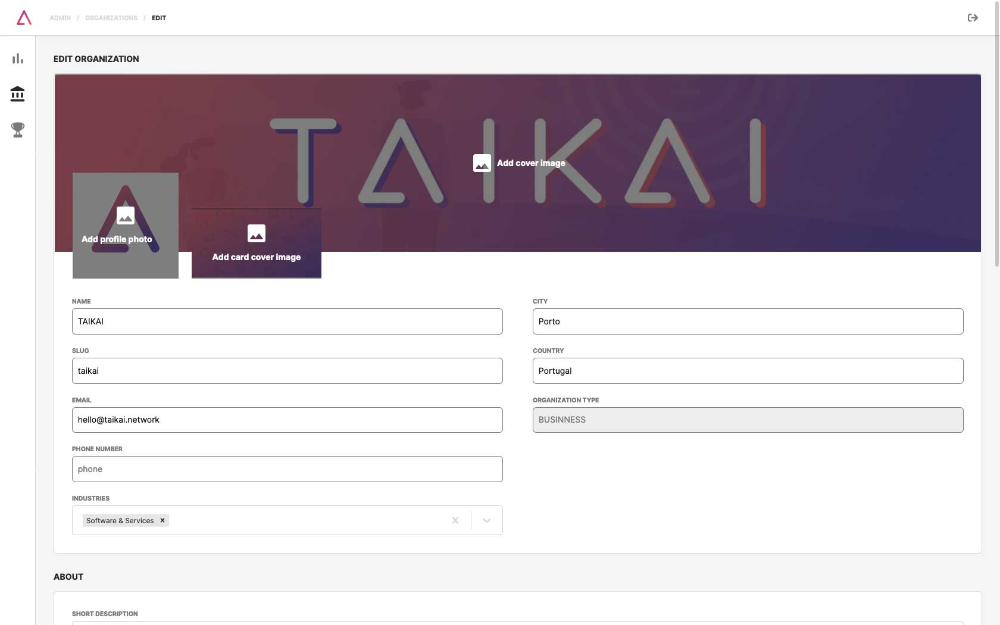
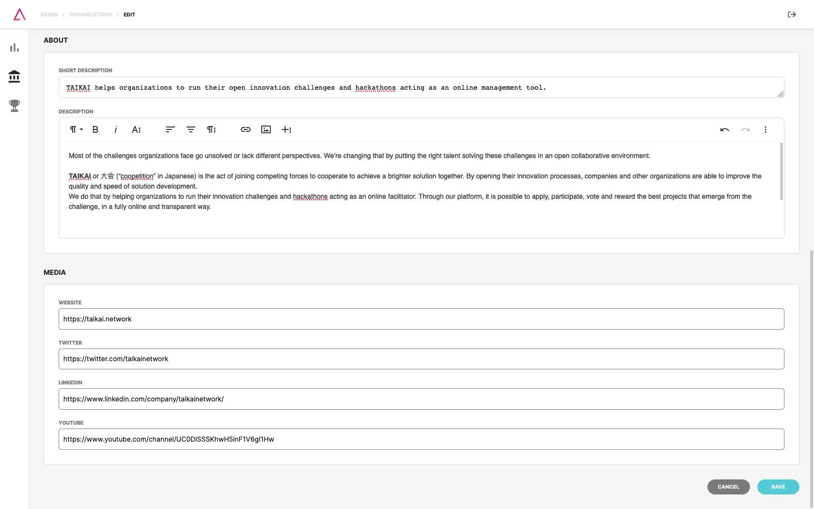
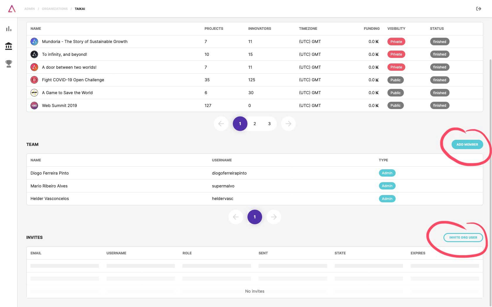
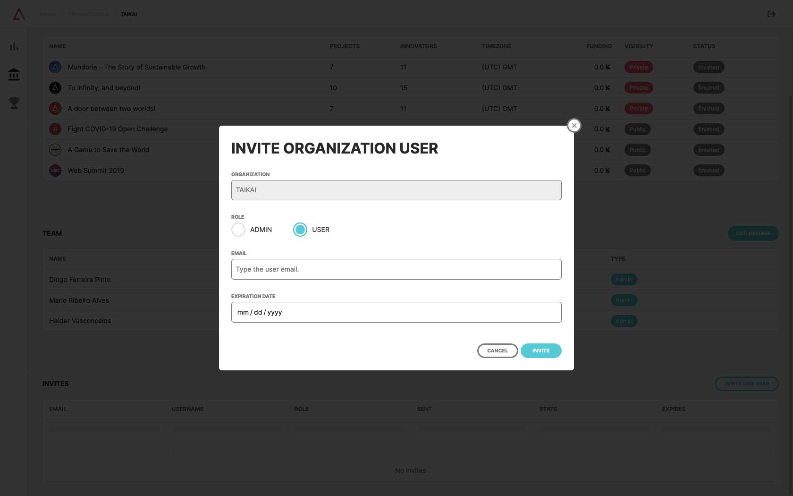

1. Click on the **"EDIT" button** on your organization to edit it;

2. Here you can change:
- Images:
  - Logo (400x400);
  - Cover (1500x500);
  - Card (600x400);
- Organization name;
- Organiztion slug;
- Location, email, phone number, industries, media;
- Short description;
- Description.

:::note
**Organization slug** is the path that completes the organization's URL on the TAIKAI platform. (e.g., taikai.network/org-name)
:::

3. On the **organizations menu** click on your organization to **add users** to your team or **invite them via email**.
