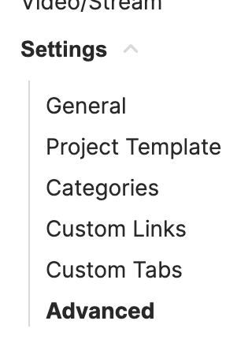
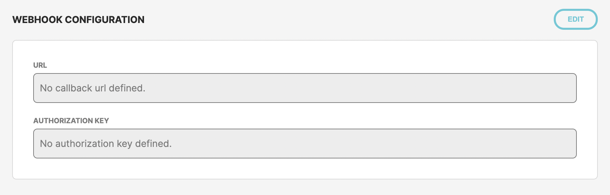
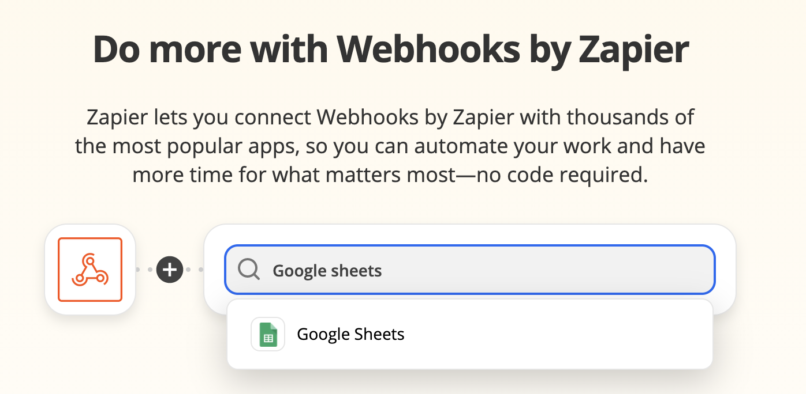
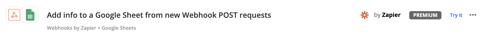
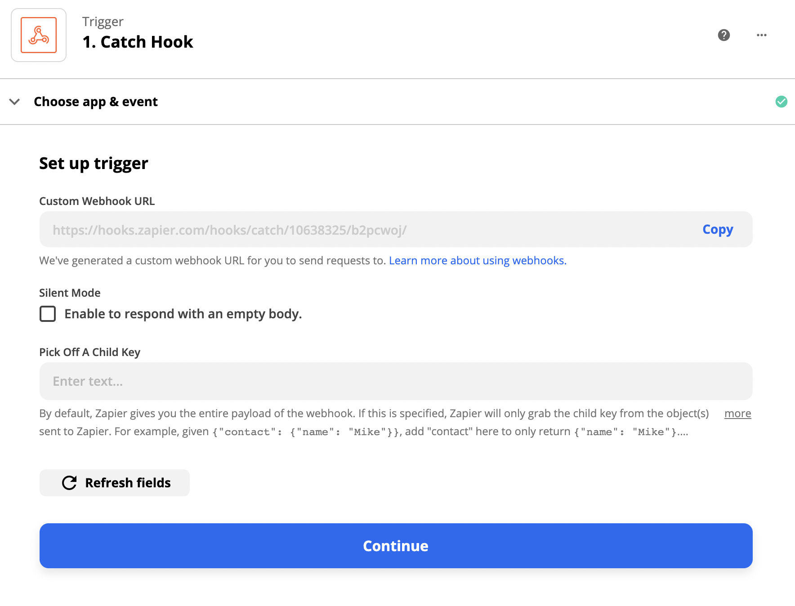
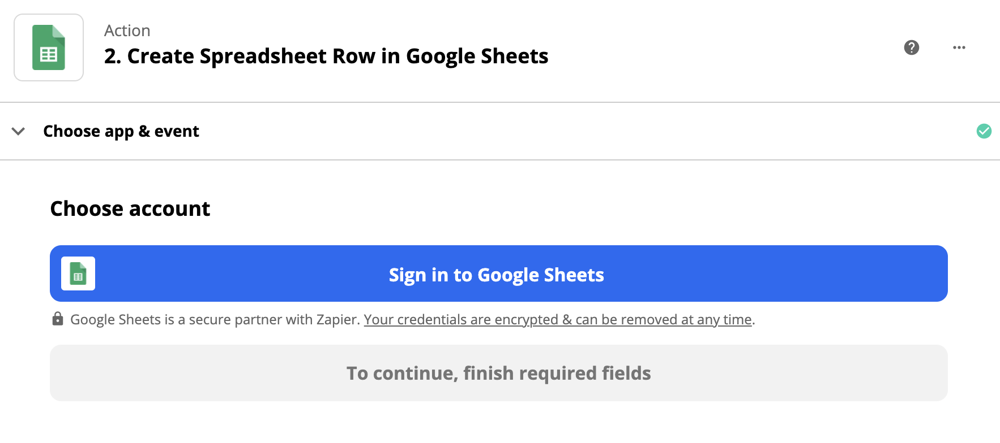
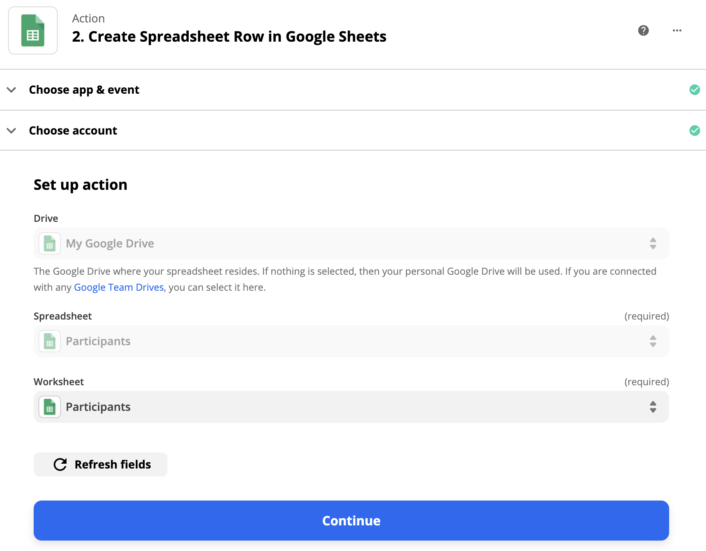
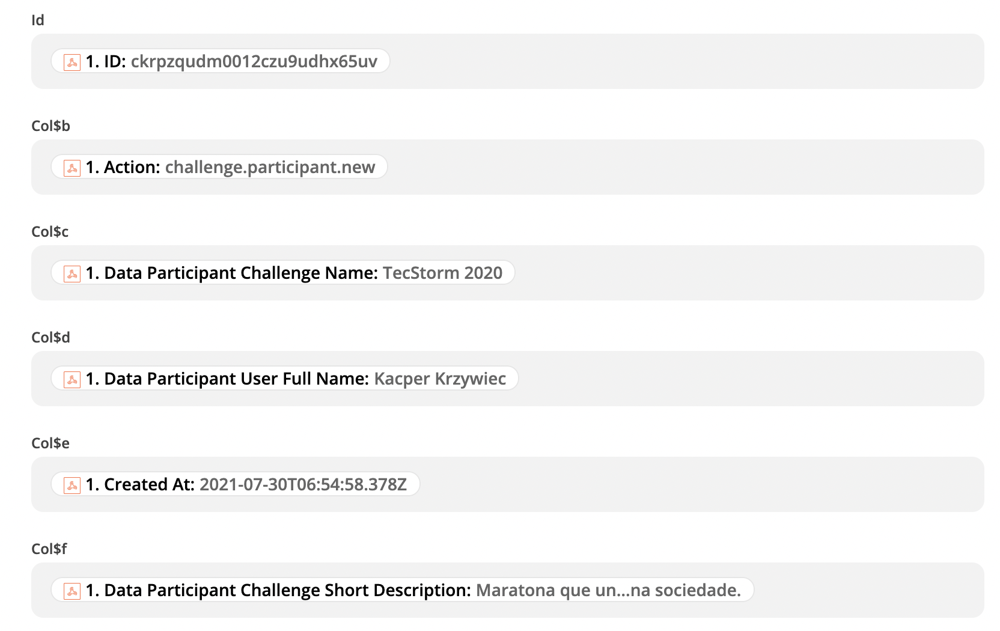
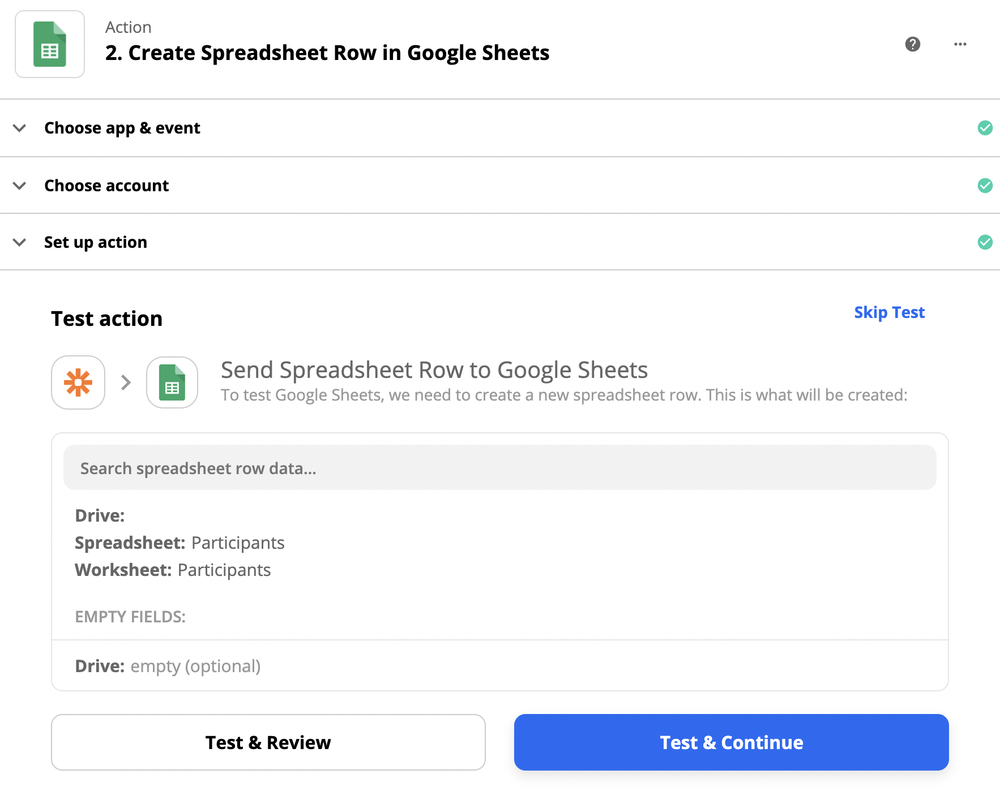
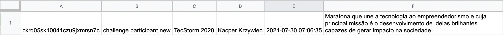

Connect your Hackathon to your favorite apps

TAIKAI hackathon is able to integrate with your favorite apps to automate your event workflows and create engagement experiences that will leverage your hackathon to a different level.

### 1. What are webhooks?

Webhook are custom callbacks triggered by certain events happening during TAIKAI hackathon. These callbacks carry messages that may be used in platforms like:
- Zapier
- n8n
- Automate.io
- IFTTT
- Microsoft Logic Apps
- etc.

for third-party applications intergations. 

Apart from productivity gains, the integration with other applications allow us to extend our functionalities by allowing the hackathon organizers to create data automations and engagement flows that as a consequence will increment the audience interaction and simplify processes.

The automation also saves you time by taking on some of your more mindless, repetitive tasks and helps you stay organized by making sure information is transferred accurately  between the event main participants.

### 2. What may you use them for?

Some of events that are propagated to external services are:

- Participant Registration 
- Jury Registration 
- New Project Submission 
- Hackathon Step Change
- Project Submission Update
- Voting Submitted 
- Challenge Update Published

These allow countless oportunities of automations like:

- creating a Twitter / Slack / Discord bot that will publish the main hackathon updates, new submissions or inform the participants that a new deadline is approaching;
- following the Hackathon Voting - Gather all the votes and deliver streamline voting reports or realtime charts to your most important event stakeholders;
- filling in a spreadsheet with all projects, all votes and all actions that take place throughout the hackathon;
- creating calendar events
- creating SMS or push notifications

### 3. Configuring webhhoks in TAIKAI CMS

In order to set up webhhoks go to advanced settings tab in the challenge configuration:

Use the edit button to update **the URL** and (if needed) **the Authorization Key** obtained from your automation platform of choice:

### 4. Example integration with Zapier to update a spreadsheet whenever a new participant registers to a challenge

Go to https://zapier.com/apps/webhook/integrations and log in to your Zapier account.

Find the section with a selection of apps possible to connect and type `Google Sheets`:

A predefined webhhok configuration will appear:

Please follow the Zapier guide to obtain the webhoook URL:

> **_NOTE:_** Use the **Custom Webhook URL** in your challange advanced configuration section in Taikai CMS as described in point 3 of this instruction ☝️ Authorization Key is not needed in the case of Zapier integration.

Follow to the Google Sheets configuration section:

Log in to yoour Google Account and select Google Sheet you wish to use:

Add necessary webhook fields mappings to spreadsheet columns names:

At this point you may click **Test & Continue**

Click **Turn on Zap** and enjoy the data automatically flowing to your Google Spreadsheet on each participant registration 🎉:

